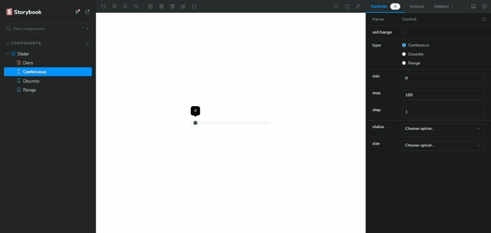
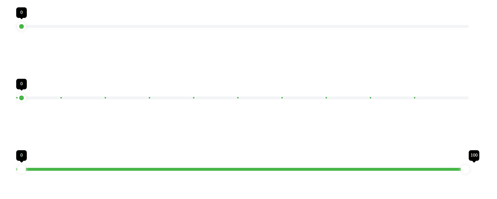

## Assignment problem

- To build different types of sliders using React and Storybook.

## Solution

- To locally run the project clone the project.
- `npm install`
- To run the project in storybook environment `npm run storybook`
- Else can use `npm run dev`

### Issues

- Issue in the continuous slider when in storybook the slider jumps to center but gets to normal when clicked no problem while using the component independently
- In the range slider the tooltips need some fixes.
- In the range slider, the slider button is not filled with a green color.

### Working Example

